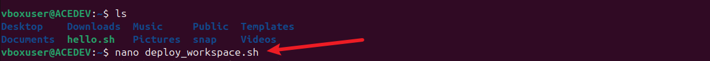
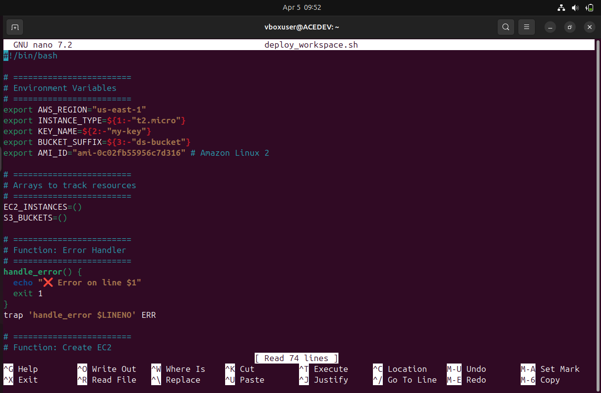
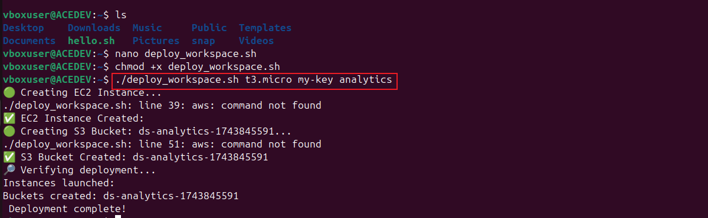

# Elevating-shell-scripting-into-cloud-computing
5 essential skills to elevate shell scripting journey into cloud computing

## 1. Functions
“Implement custom functions to modularize tasks like creating EC2 instances, configuring S3 buckets, and verifying deployment statuses.”

What this means:

Break the script into reusable blocks (functions).

Example: One function to launch an EC2 instance, another to create an S3 bucket.

Makes the code cleaner, easier to debug, and reusable.

 Why it matters: Makes the script more readable and allows you to reuse logic without duplicating code.

## 2. Arrays
“Use arrays to manage a list of resources created, ensuring easy tracking and manipulation.”

What this means:

Use shell arrays to store IDs or names of resources.

Example: Keep track of all created EC2 instances and S3 buckets.

* Why it matters: Helps track what was created, especially useful for validation or cleanup later.

## 3. Environment Variables
“Leverage environment variables to store sensitive information like AWS credentials, region settings, and configuration parameters, enhancing script portability and security.”

What this means:

Instead of hardcoding values like AWS region or instance type, store them in environment variables.

Example: export AWS_REGION=us-east-1

* Why it matters: Improves portability and security. Environment variables can be loaded from a .env file or exported dynamically.

## 4. Command Line Arguments
“Accept command line arguments to customize the script’s behavior, such as specifying the EC2 instance type or S3 bucket name, allowing for dynamic and flexible deployments.”

What this means:

Allow users to pass arguments when they run the script.

Example: ./deploy.sh t2.micro my-key mybucket

* Why it matters: Makes the script flexible — users can customize behavior without editing the script.

## 5. Error Handling
“Implement robust error handling mechanisms to catch and respond to AWS service exceptions, ensuring the script can recover gracefully from failures.”

What this means:

Use trap and checks (if [ $? -ne 0 ]) to catch and report errors.

Exit gracefully and print meaningful messages if something goes wrong.

* Why it matters: Prevents silent failures and helps users understand what went wrong.

* In Summary:
This shell script is not just about automating AWS tasks — it’s about writing clean, maintainable, and robust code that applies real-world scripting practices. These five requirements ensure the script is production-ready and educational.

## Pratical:

The first step is to create an excecutable shell script by creating a new file "deploy_workspace.sh
which is done using the "nano" command "nano deploy_workspace.sh"

afterwhich i write a shell script using 5 concepts which are : Functionc, Arrays, Environmental Variables, Command line Arguments and Error handling to automate the setting up of EC2 instances and s3 buckets for Datawise solutions
 after creating the file above i wrote my shell scripst using the 5 concepts in shell scripting mentioned above:
 
***   

#!/bin/bash

## Environment Variables

export AWS_REGION="us-east-1"
export INSTANCE_TYPE=${1:-"t2.micro"}
export KEY_NAME=${2:-"my-key"}
export BUCKET_SUFFIX=${3:-"ds-bucket"}
export AMI_ID="ami-0c02fb55956c7d316" # Amazon Linux 2

## Arrays to track resources
EC2_INSTANCES=()
S3_BUCKETS=()

# Function: Error Handler

handle_error() {
echo "Error on line $1"
exit 1
}
trap 'handle_error $LINENO' ERR

# Function: Create EC2

create_ec2_instance() {
echo "Creating EC2 Instance..."
INSTANCE_ID=$(aws ec2 run-instances \
--image-id $AMI_ID \
--count 1 \
--instance-type $INSTANCE_TYPE \
--key-name $KEY_NAME \
--region $AWS_REGION \
--query "Instances[0].InstanceId" \
--output text)

EC2_INSTANCES+=("$INSTANCE_ID")
echo "EC2 Instance Created: $INSTANCE_ID"
}

***

 
 after write and saving my shell script i made it exceutable using the command "chmod +x deploy_worspace.sh"
 
 now the shell script is ready to be executed and the command "./deploy_worspace.sh t3.micro my-key analytics" is used to run the shell script and we can see below it was succcessful
 
 